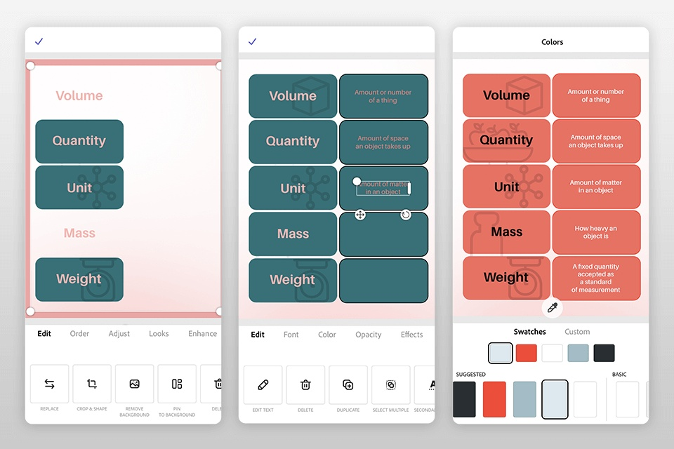

# Interactive Flashcard Study Tool



## Introduction
This project is an interactive flashcard study tool that allows users to study various topics using virtual flashcards. Users can navigate through flashcards, flip them to see answers, shuffle the cards, and restart the session. This tool is designed to make learning and memorization more engaging and effective.

## Features
- Navigate through flashcards (previous and next)
- Flip flashcards to reveal answers
- Shuffle flashcards for random order
- Restart the flashcard session
- Visual indication of viewed cards

## Technologies Used
- HTML
- CSS
- JavaScript

## File Structure
```
project-folder/
├── index.html        # The main HTML file
├── styles.css        # The CSS file for styling
├── script.js         # The JavaScript file for functionality
└── flashcards.json   # JSON file containing flashcard data
```

## Setup and Installation
1. Clone the repository to your local machine.
   ```
   git clone https://github.com/your-username/flashcard-study-tool.git
   ```
2. Navigate to the project directory.
   ```
   cd flashcard-study-tool
   ```
3. Open `index.html` in your preferred web browser.
   
## Usage
- **Navigate Flashcards:** Use the 'Previous' and 'Next' buttons to navigate through the flashcards.
- **Flip Flashcards:** Click on the 'Flip' button to flip the card and reveal the answer.
- **Shuffle Flashcards:** Click on the 'Shuffle' button to randomize the order of the flashcards.
- **Restart Session:** Click on the 'Restart' button to start the session from the beginning and clear the seen cards indicator.

## Flashcard Data
The flashcard data is stored in the `flashcards.json` file. Each flashcard entry is an object with `question` and `answer` fields, like so:
```json
[
  { "question": "What is the capital of France?", "answer": "Paris" },
  { "question": "What is 2 + 2?", "answer": "4" },
  { "question": "What is the chemical symbol for water?", "answer": "H2O" }
]
```

## Customization
To add or modify flashcards, edit the `flashcards.json` file. Simply follow the format:
```json
{
  "question": "Your Question Here",
  "answer": "Your Answer Here"
}
```

## License
This project is open-source and available under the [MIT License](https://opensource.org/licenses/MIT).

## Contributing
Contributions are welcome! Please fork the repository and create a pull request with your changes.

## Contact
For questions or suggestions, please open an issue in the repository or contact [your-email@example.com].

## Acknowledgments
Thanks to everyone who contributed to this project!
